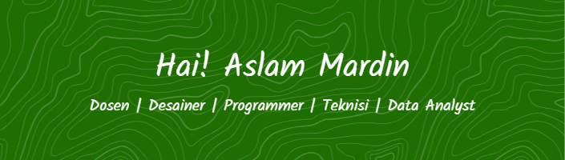

<h1 align="center">
  
</h1>

<h3 align="center">🎓 Dosen | Desainer | Programmer | Teknisi | Data Analyst</h3>

<!--  -->

##### 👋 Tentang Saya
- 🎓 Lulusan S1 **Universitas Al Asyariah Mandar**
- 🎓 Lulusan S2 **Universitas Handayani Makassar**
- 💼 Saat ini: **PJ Media Center Pondok Pesantren Modern Al-Ikhlash Lampoko**
- 👨‍🏫 Dosen di Sulawesi Barat, mengajar desain, jaringan, dan komputer
- 👨‍💻 Mahir dalam pengembangan web, jaringan, service hardware, dan analisis data

---

<!-- ### 🧠 Keahlian Teknis

  
  
  
  
  
  
  
  
  
  
  
  
  
  
  
  
  
  
  
  
  
  
  
  
  

---

### 💬 Kemampuan Bahasa
- 🗣️ Bahasa Mandar
- 🇮🇩 Bahasa Indonesia
- 🇬🇧 Bahasa Inggris

---

### 📚 Riwayat Pendidikan
| Sekolah                            | Tahun Lulus |
|------------------------------------|-------------|
| SDN 036 INP Bonde                  | 2011        |
| MTS PERGIS Campalagian             | 2014        |
| SMKN Labuang                       | 2017        |

---

### 💼 Pengalaman Profesional
- PKL di Telkom Majene dan Pengadilan Agama Polewali Mandar  
- Mengajar di SMP PPM Al-Ikhlash Lampoko dan Sekolah Soeparman Wonomulyo  
- Service HP, Laptop, Printer di Workit Polewali  
- Freelance: jasa pengerjaan skripsi dan jurnal mahasiswa

---

##### 📚 Skill Language Program
<!-- Bahasa Pemrograman -->
<!-- 

  

##### 📱 Sosial Media & Kontak

  

    
    
    
    
    
  

---
 
### 📈 Statistik GitHub

  
   
  

--- -->

 

<!-- <h1 align="left">Hi 👋! Nama Saya Aslam Mardin</h1> -->

### Statistik Github

  
  

###

 

###

  
  
  
  
  
  
  
  
  
  
  
  
  
  
  
  
  
  
  
  
  
  
  
  
  
  
  
  
  
  
  
  
  
  
  
  
  
  
  
  
  
  
  
  
  
  
  

##### 📱 Sosial Media & Kontak

  

    
    
    
    
    
  

 

###

<picture>
  <source media="(prefers-color-scheme: dark)" srcset="https://raw.githubusercontent.com/AslamMardin/AslamMardin/output/pacman-contribution-graph-dark.svg">
  <source media="(prefers-color-scheme: light)" srcset="https://raw.githubusercontent.com/AslamMardin/AslamMardin/output/pacman-contribution-graph.svg">
  
</picture>

###

  

###